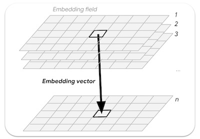
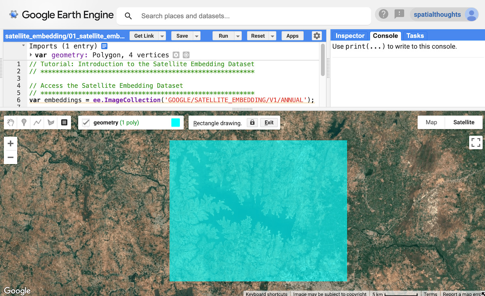
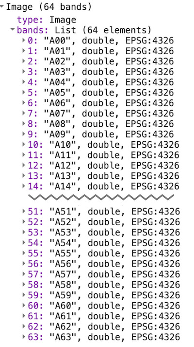
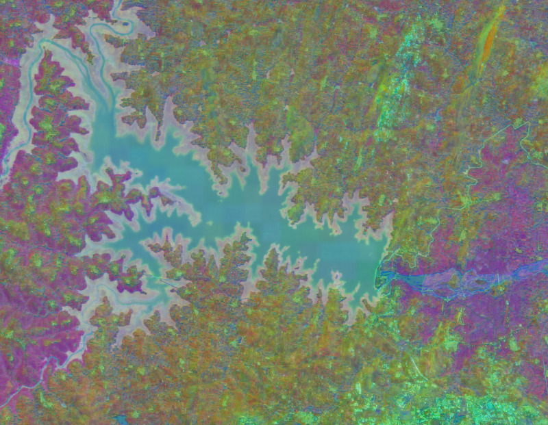
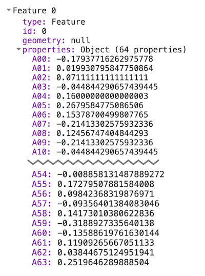
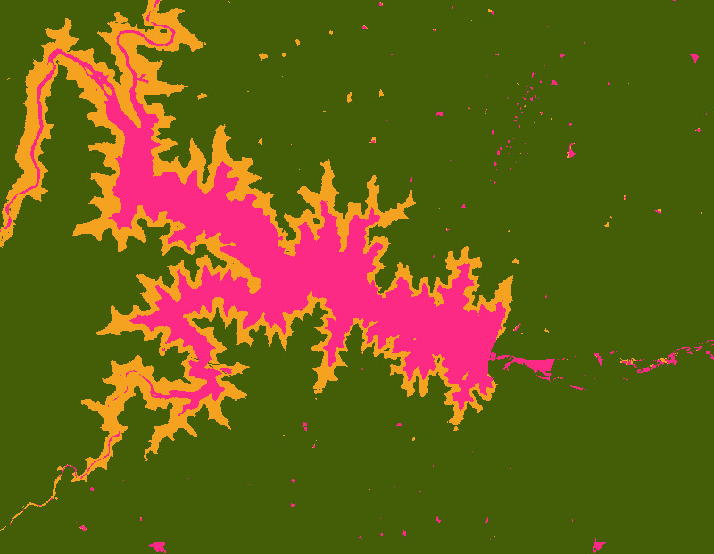
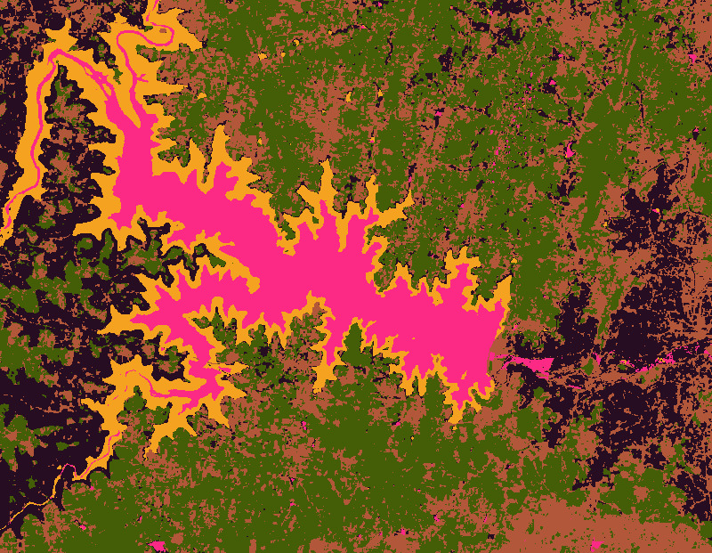
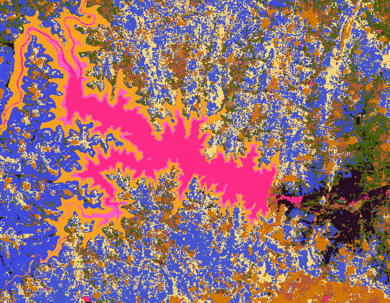

<!--
Copyright 2025 The Google Earth Engine Community Authors

Licensed under the Apache License, Version 2.0 (the "License");
you may not use this file except in compliance with the License.
You may obtain a copy of the License at

    http://www.apache.org/licenses/LICENSE-2.0

Unless required by applicable law or agreed to in writing, software
distributed under the License is distributed on an "AS IS" BASIS,
WITHOUT WARRANTIES OR CONDITIONS OF ANY KIND, either express or implied.
See the License for the specific language governing permissions and
limitations under the License.
-->

_This tutorial is part of a series of tutorials on the Satellite Embedding dataset, see also
[Unsupervised Classification](/earth-engine/tutorials/community/satellite-embedding-02-unsupervised-classification),
[Supervised Classification](/earth-engine/tutorials/community/satellite-embedding-03-supervised-classification), [Regression](/earth-engine/tutorials/community/satellite-embedding-04-regression) and [Similarity Search](/earth-engine/tutorials/community/satellite-embedding-05-similarity-search)._

Google’s AlphaEarth Foundations is a geospatial embedding model trained on a variety of Earth observation (EO) datasets. The model has been run on annual time-series of images and the resulting embeddings are available as an analysis-ready dataset in Earth Engine. This dataset enables users to build any number of fine-tuning applications or other tasks without running computationally expensive deep learning models. The result is a general-purpose dataset that can be used for a number of different downstream tasks, such as

* Classification
* Regression
* Change detection
* Similarity search

In this tutorial we will understand how embeddings work and learn how to access and visualize the Satellite Embedding dataset.


## Understanding embeddings

Embeddings are a way to compress large amounts of information into a smaller set of features that represent meaningful semantics. The AlphaEarth Foundations model takes time series of images from sensors including Sentinel-2, Sentinel-1, and Landsat and learns how to uniquely represent the mutual information between sources and targets with just 64 numbers (learn more in the [paper](https://arxiv.org/abs/2507.22291)). The input data stream contains thousands of image bands from multiple sensors and the model takes this high dimensional input and turns it into a lower dimensional representation.

A good mental model to understand how AlphaEarth Foundations works is a technique called Principal Component Analysis (PCA). PCA also helps reduce the dimensionality of the data for machine learning applications. While PCA is a statistical technique and can compress tens of input bands into a handful of principal components, AlphaEarth Foundations is a deep-learning model that can take thousands of input dimensions of multi-sensor time-series datasets and learns to create a 64-band representation that uniquely captures the spatial and temporal variability of that pixel.

An embedding field is the continuous array or “field” of learned embeddings. Images in the embedding fields collections represent space-time trajectories covering an entire year and have 64 bands (one for each embedding dimension).

{: width=512px}<br>
_Figure: n-dimensional embedding vector sampled from an embedding field_

## Access the Satellite Embedding dataset

The Satellite Embedding dataset is an [image collection](https://developers.google.com/earth-engine/datasets/catalog/GOOGLE_SATELLITE_EMBEDDING_V1_ANNUAL) containing annual images from the years 2017 onward (e.g., 2017, 2018, 2019…). Each image has 64 bands where each pixel is the embedding vector representing the multi-sensor time-series for the given year.

```js
var embeddings = ee.ImageCollection('GOOGLE/SATELLITE_EMBEDDING/V1/ANNUAL');
```

## Select a region

Let’s start by defining a region of interest. For this tutorial, we will pick a region around the Krishna Raja Sagara (KRS) Reservoir in India and define a polygon as the geometry variable. Alternatively, you can use the Drawing Tools in the Code Editor to draw a polygon around the region of interest that will be saved as the `geometry` variable in the Imports.

```js
// Use the satellite basemap
Map.setOptions('SATELLITE');

var geometry = ee.Geometry.Polygon([[
  [76.3978, 12.5521],
  [76.3978, 12.3550],
  [76.6519, 12.3550],
  [76.6519, 12.5521]
]]);

Map.centerObject(geometry, 12);
```

{: width=512px}<br>
_Figure: Selecting the region of interest_

## Prepare the Satellite Embedding dataset

Each year’s images are split into tiles for easy access. We apply filters and find the images for our chosen year and region.

```js
var year = 2024;
var startDate = ee.Date.fromYMD(year, 1, 1);
var endDate = startDate.advance(1, 'year');

var filteredEmbeddings = embeddings
  .filter(ee.Filter.date(startDate, endDate))
  .filter(ee.Filter.bounds(geometry));
```

Satellite Embedding images are gridded into tiles of up to 163,840 m x 163,840 m each and served in the projection for the UTM zones for the tile. As a result, we get multiple Satellite Embedding tiles covering the region of interest. We can use the `mosaic()` function to combine multiple tiles into a single image. Let’s print the resulting image to see the bands.

Tip: Using `mosaic()` loses the original UTM projection and the resulting image will be set to a Default Projection, which is WGS84 with a 1-degree scale. This is fine for most cases, and you can specify the scale and projection suitable for your region when sampling data or exporting the results. For example, if you specify the `crs` as EPSG:3857 and `scale` as 10m, Earth Engine will reproject all the inputs to that projection and ensure the operation occurs in that projection. However, in some cases–especially for global-scale analyses, where no ideal projection exists and you do not want pixels in a geographic CRS–it may be more effective to leverage the built-in tiling structure by using `map()` on the collection. This approach retains the original UTM projection of each tile and can yield more accurate results.

```js
var embeddingsImage = filteredEmbeddings.mosaic();
print('Satellite Embedding Image', embeddingsImage);
```

You will see that the image has 64 bands, named A00, A01, … , A63. Each band contains the value of the embedding vector for the given year in that dimension or axis. Unlike spectral bands or indices, individual bands have no independent meaning – rather, each band represents one axis of the embedding space. You would use all of the 64 bands as inputs for your downstream applications.

{: width="350"}<br>
_Figure: 64 bands of the satellite embedding image_

## Visualize the Satellite Embedding dataset

As we just saw, our image contains 64 bands. There is no easy way to visualize all the information contained in all the bands since we can only view a combination of three bands at a time.

We can pick any three bands to visualize three axes of the embedding space as an RGB image.

```js
var visParams = {min: -0.3, max: 0.3, bands: ['A01', 'A16', 'A09']};
Map.addLayer(embeddingsImage.clip(geometry), visParams, 'Embeddings Image');
```

{: width=512px}<br>
_Figure: RGB Visualization of 3 axes of the embedding space_

An alternative way to visualize this information is by using it to group pixels with similar embeddings and use these groupings to understand how the model has learnt the spatial and temporal variability of a landscape.

We can use unsupervised clustering techniques to group the pixels in 64-dimensional space into groups or "clusters" of similar values. For this, we first sample some pixel values and train an [`ee.Clusterer`](https://developers.google.com/earth-engine/guides/clustering).

```js
var nSamples = 1000;
var training = embeddingsImage.sample({
  region: geometry,
  scale: 10,
  numPixels: nSamples,
  seed: 100
});
print(training.first());
```

If you print the values of the first sample, you’ll see it has 64 band values defining the embedding vector for that pixel. The embedding vector is designed to have a unit length (i.e., the length of the vector from the origin (0,0,....0) to the values of the vector will be 1).

{: width=400px}<br>
_Figure: Extracted embedding vector_

We can now train an unsupervised model to group the samples into the desired number of clusters. Each cluster would represent pixels of similar embeddings.

```js
// Function to train a model for desired number of clusters
var getClusters = function(nClusters) {
  var clusterer = ee.Clusterer.wekaKMeans({nClusters: nClusters})
    .train(training);

  // Cluster the image
  var clustered = embeddingsImage.cluster(clusterer);
  return clustered;
};
```

We can now cluster the larger embedding image to see groups of pixels having similar embeddings. Before we do that, it is important to understand that the model has captured the full temporal trajectory of each pixel for the year - that means if two pixels have similar spectral values in all images but at different times - they can be separated.

Below is a visualization of our area of interest as captured by cloud-masked Sentinel-2 images for the year 2024. Remember that all the images (along with images from Sentinel-2, Landsat 8/9 and many more sensors) have been used to learn the final embeddings.

{: width=512px}<br>
_Figure: Sentinel-2 annual time-series for our region_

Let’s visualize the Satellite Embedding images by segmenting the landscape into 3 clusters,

```js
var cluster3 = getClusters(3);
Map.addLayer(cluster3.randomVisualizer().clip(geometry), {}, '3 clusters');
```

{: width=512px}<br>
_Figure: Satellite Embedding image with 3 clusters_

You will notice that the resulting clusters have very clean boundaries. This is because the embeddings inherently include spatial context - pixels within the same object would be expected to have relatively similar embedding vectors. Also, one of the clusters includes areas with seasonal water around the main reservoir. This is due to the temporal context that is captured in the embedding vector that allows us to detect such pixels with similar temporal patterns.

Let’s see if we can further refine the clusters by grouping the pixels into 5 clusters.

```js
var cluster5 = getClusters(5);
Map.addLayer(cluster5.randomVisualizer().clip(geometry), {}, '5 clusters');
```

{: width=512px}<br>
_Figure: Satellite Embedding image with 5 clusters_

We can keep going and refine the images into more specialized groups by increasing the number of clusters. Here’s what the image looks like with 10 clusters.

```js
var cluster10 = getClusters(10);
Map.addLayer(cluster10.randomVisualizer().clip(geometry), {}, '10 clusters');
```

{: width=512px}<br>
_Figure: Satellite Embedding image with 10 clusters_

There are a lot of details emerging and we can see different types of crops being grouped into different clusters. As the Satellite Embedding captures the crop phenology along with climatic variables, it is well-suited for crop type mapping. In the [next tutorial](/earth-engine/tutorials/community/satellite-embedding-02-unsupervised-classification) (Unsupervised Classification), we will see how to create a crop-type map with Satellite Embedding data with little or no field-level labels.

[Try the full script for this tutorial in the Earth Engine Code Editor](https://code.earthengine.google.com/cc4871f10c6f45271bbeae1b9565b944).
