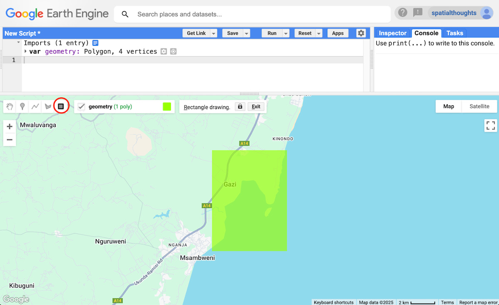
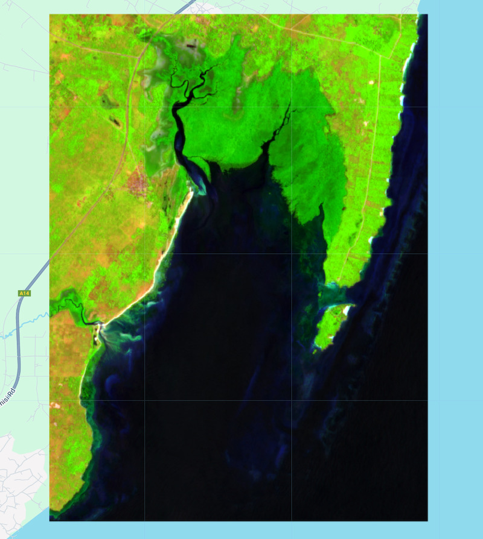
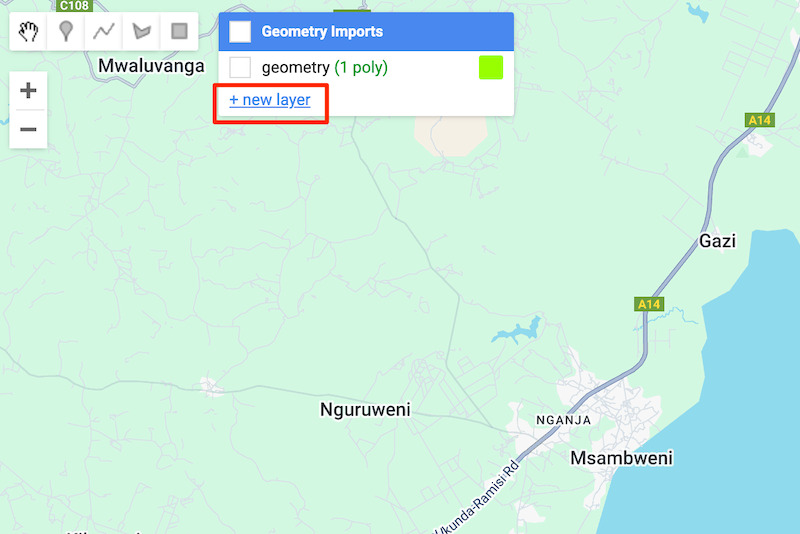
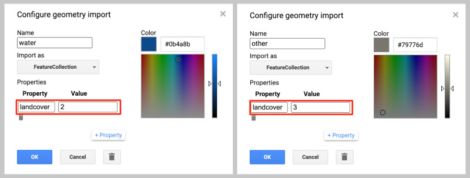
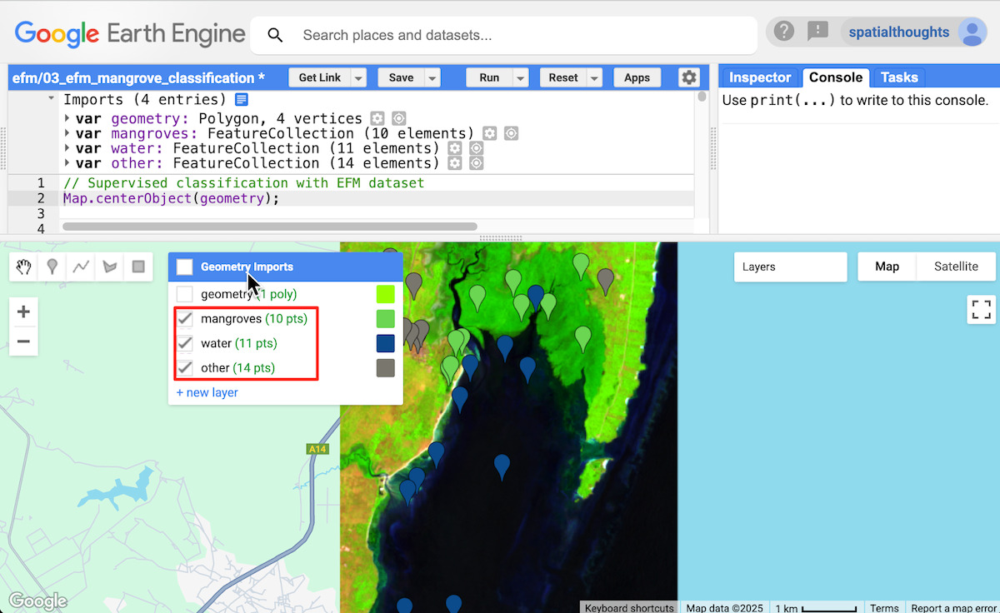
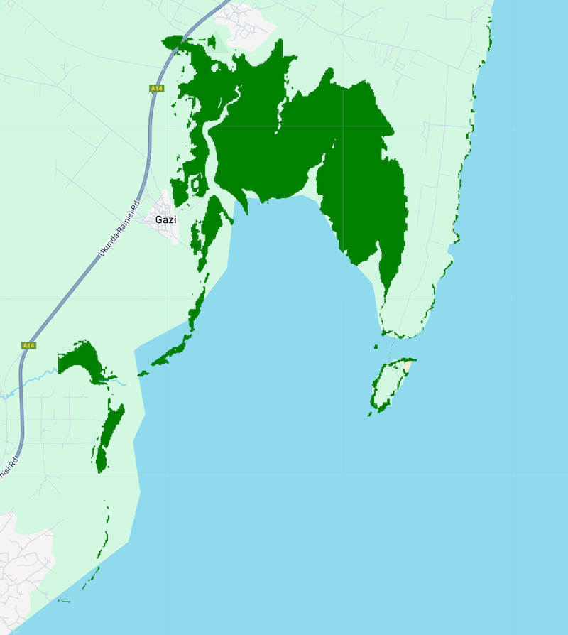

<!--
Copyright 2025 The Google Earth Engine Community Authors

Licensed under the Apache License, Version 2.0 (the "License");
you may not use this file except in compliance with the License.
You may obtain a copy of the License at

    http://www.apache.org/licenses/LICENSE-2.0

Unless required by applicable law or agreed to in writing, software
distributed under the License is distributed on an "AS IS" BASIS,
WITHOUT WARRANTIES OR CONDITIONS OF ANY KIND, either express or implied.
See the License for the specific language governing permissions and
limitations under the License.
-->

_This tutorial is part of a series of tutorials on the Satellite Embedding dataset, see also
[Introduction](/earth-engine/tutorials/community/satellite-embedding-01-introduction),
[Unsupervised Classification](/earth-engine/tutorials/community/satellite-embedding-02-unsupervised-classification), [Regression](/earth-engine/tutorials/community/satellite-embedding-04-regression) and [Similarity Search](/earth-engine/tutorials/community/satellite-embedding-05-similarity-search)._

Satellite Embeddings can be used for standard remote sensing classification workflows. The embeddings were specifically designed to excel  at low-shot learning, meaning that a relatively small number of labeled data (think 10s to 100s of samples) is required to achieve high-quality classification results. Since the embeddings include spectral, spatial, and temporal context, simple classifiers such as [k-Nearest Neighbors (kNN)](https://developers.google.com/earth-engine/apidocs/ee-classifier-smileknn)  or [Random Forest](https://developers.google.com/earth-engine/apidocs/ee-classifier-smilerandomforest) can use the embedding vectors to classify complex landscapes into target classes.

In this tutorial, we will learn how to use a supervised learning approach using kNN classifier to classify mangroves using the Satellite Embedding.

## Select a region

Let’s start by defining a region of interest. For this tutorial, we will pick a region along the Kenyan coastline and define a polygon as the geometry variable. Alternatively, you can use the Drawing Tools in the Code Editor to draw a polygon around the region of interest that will be saved as the geometry variable in the Imports.

```js
var geometry = ee.Geometry.Polygon([[
  [39.4926, -4.39833],
  [39.4926, -4.47394],
  [39.5491, -4.47394],
  [39.5491, -4.39833]
]]);
```

<br>
_Figure: Selecting the area of interest for mangrove classification_

## Collect training samples

Classification workflows with the Satellite Embedding only requires a handful of labeled samples to achieve relatively accurate results. For our landcover classification, it is easiest to drop points and label them in Earth Engine to create the training samples. We will create a 3-class classification that will classify each pixel from the Satellite Embedding into one of the following three classes:

| Landcover Class | Description | Class Value |
| :-------------- | :---------- | :---------- |
| mangroves | All species of salt-tolerant coastal vegetation | 1 |
| water | All surface water - lake, ponds, rivers, ocean etc. | 2 |
| other | All other surfaces - including built, exposed soil, sand, crops, trees etc. | 3 |

To enable us to label points correctly, we first create a Sentinel-2 cloud-free composite and load it. We choose a false-color visualization that highlights the difference between water, vegetation, and built surfaces, allowing us to pick appropriate samples easily.

```js
// Pick a year for classification
var year = 2020;
var startDate = ee.Date.fromYMD(year, 1, 1);
var endDate = startDate.advance(1, 'year');

// Create a Sentinel-2 composite for the selected year
// for selecting training samples
var s2 = ee.ImageCollection('COPERNICUS/S2_SR_HARMONIZED');
var filteredS2 = s2
  .filter(ee.Filter.date(startDate, endDate))
  .filter(ee.Filter.bounds(geometry));

// Use the Cloud Score+ collection for cloud masking
var csPlus = ee.ImageCollection('GOOGLE/CLOUD_SCORE_PLUS/V1/S2_HARMONIZED');
var csPlusBands = csPlus.first().bandNames();
var filteredS2WithCs = filteredS2.linkCollection(csPlus, csPlusBands);

function maskLowQA(image) {
  var qaBand = 'cs';
  var clearThreshold = 0.6;
  var mask = image.select(qaBand).gte(clearThreshold);
  return image.updateMask(mask);
}

var filteredS2Masked = filteredS2WithCs
  .map(maskLowQA)
  .select('B.*');

// Create a median composite of cloud-masked images
var composite = filteredS2Masked.median();
// Display the input composite
var swirVis = {min: 300, max: 4000, bands: ['B11', 'B8', 'B4']};

Map.centerObject(geometry);
Map.addLayer(composite.clip(geometry), swirVis, 'S2 Composite (False Color)');
```

{: width="600"}<br>
_Figure: Sentinel-2 false color composite_

We now have a reference image from the target year that can be used to label samples for classification. First, we will configure the layers for collecting samples. Open the *Geometry Imports* section and click *+ new layer*.

<br>
_Figure: Creating a new layer_

Click the Edit Layer Properties (Gear Icon) next to the new layer and configure it as shown below. Enter the layer name as `mangroves` and change the type to be `FeatureCollection`. Click *+ Property* and add a new property `landcover` with the value `1`. Change the color to be a shade of green and click OK.

{: width="400"}<br>
_Figure: Configuring the layer properties for mangroves layer_

Similarly, add 2 new layers for the other classes. Use the `landcover` value `2` for water and `3` for other.

<br>
_Figure: Configuring the layer properties for (left) water and (right) other layers_

Once the layers are configured, we can start collecting samples. Zoom in to a region and visually identify pixels of different classes. Select the `mangroves` layer and use the *Add a marker* tool to drop points on pixels belonging to mangrove forests, which tend to appear as a mid-toned green in our false-color Sentinel-2 composite (and you can also check the Satellite basemap view for reference). You do not need many points when classifying with the Satellite Embedding dataset; rather it’s more important to select high-quality examples that represent variability within your region of interest. For this tutorial, a set of 10 samples should be enough.

<br>
_Figure: Collecting samples for mangroves class_

Next, switch to the `water` layer and collect samples for surface water pixels, which appear almost black in our Sentinel-2 composite due to strong absorption of the SWIR bands for open water. Repeat the process for the `other` layer, selecting examples of that are clearly neither `mangrove` nor `water`.

<br>
_Figure: Collecting samples for water and other classes_

The training sample collection is now complete. We can merge the three individual FeatureCollections to a single collection of ground control points (gcps).

```js
var gcps = mangroves.merge(water).merge(other);
```

## Train a classifier

We are now ready to train a classifier. We load the Satellite Embedding dataset, filter to tiles for our chosen year and region of interest,  create a mosaic, and then sample the embedding vectors to create a training dataset.

```js
var embeddings = ee.ImageCollection('GOOGLE/SATELLITE_EMBEDDING/V1/ANNUAL');

var embeddingsFiltered = embeddings
  .filter(ee.Filter.date(startDate, endDate))
  .filter(ee.Filter.bounds(geometry));

var embeddingsImage = embeddingsFiltered.mosaic();

// Overlay the samples on the image to get training data.
var training = embeddingsImage.sampleRegions({
  collection: gcps,
  properties: ['landcover'],
  scale: 10
});

print('Training Feature', training.first());
```

The training features have the embedding vectors as the input properties and the associated label as the class property. We can now train a classifier with these extracted features. We can choose from a variety of classifiers available in Earth Engine. A good choice for low-shot classification (classification using a very small number of examples, like our example), is k-Nearest Neighbors (kNN). In a kNN classification, labeled examples are used to “partition” or cluster the embedding space, assigning a label for each pixel based on the label(s) of its closest neighbor(s) in the embedding space. Let’s train a kNN classifier with our training data.

```js
var classifier = ee.Classifier.smileKNN().train({
  features: training,
  classProperty: 'landcover',
  inputProperties: embeddingsImage.bandNames()
});
```

## Classify the Satellite Embedding mosaic

We can now use the trained classifier to predict the class at all the pixels of the Satellite Embedding mosaic.

```js
var classified = embeddingsImage.classify(classifier);
```

## Export classified image to an asset (optional)

Tip: This example is designed to work interactively, but may not scale to larger regions and/or numbers of samples. In this case, you can use an export to overcome scaling issues.

If you are trying to classify a large region, Earth Engine needs more time than what is permitted in the interactive computing environment. It is a good practice to [export intermediate results](https://developers.google.com/earth-engine/guides/best_practices#export_intermediate_results) as Assets to leverage the batch computing environment which has longer limits for task execution and has more resources. This also helps overcome *computation timed out* or *user memory exceeded* errors when working with large regions. Let’s export the classified image.

```js
// Replace this with your asset folder
// The folder must exist before exporting
var exportFolder = 'projects/spatialthoughts/assets/satellite_embedding/';

var classifiedExportImage = 'mangrove_classification';
var classifiedExportImagePath = exportFolder + classifiedExportImage;

Export.image.toAsset({
  image: classified.clip(geometry),
  description: 'Classified_Image_Export',
  assetId: classifiedExportImagePath,
  region: geometry,
  scale: 10,
  maxPixels: 1e10
});
```

Start the export tasks and wait for it to finish before proceeding further. Once the export task is finished, we import classified image back into our code.

```js
// Use the exported asset
var classified = ee.Image(classifiedExportImagePath);
```

## Visualize the classification

Whether you ran your classification interactively or exported to an asset, you will now have a classified variable with the results of your classification.

```js
// Choose a 3-color palette
// Assign a color for each class in the following order
// Mangrove, Water, Other
var palette = ['green', 'blue', 'gray'];

Map.addLayer(
  classified.clip(geometry),
  {min: 1, max: 3, palette: palette},
  'Classified Satellite Embeddings Image');
```

{: width="600"}<br>
_Figure: Classified satellite embeddings image_

## Create a mangrove map

We created a classified image with 3 classes. We can extract the pixels classified as Mangroves (class 1) to create a mangrove map.

```js
// Extract mangroves class
var mangrovesImage = classified.eq(1).selfMask();

var mangroveVis = {min: 0, max: 1, palette: ['green']};

Map.addLayer(mangrovesImage.clip(geometry),
  mangroveVis, 'Mangroves Map (Satellite Embedding Classification)');
```

{: width="600"}<br>
_Figure: Mangroves map_

## Validate the results

To evaluate our results, we can compare them with a high-quality peer-reviewed dataset: [Global Mangrove Watch](https://www.mdpi.com/2072-4292/14/15/3657). This dataset was derived from L-band Synthetic Aperture Radar (SAR) from JAXA and has annual mangrove maps from 1996-2020. This dataset is available on the [GEE Community Catalog](https://gee-community-catalog.org/projects/mangrove/), so we can easily load and visualize it in Earth Engine.

```js
var gmw = ee.ImageCollection(
  'projects/earthengine-legacy/assets/projects/sat-io/open-datasets/' +
  'GMW/extent/GMW_V3');
var gmwFiltered = gmw
  .filter(ee.Filter.date(startDate, endDate))
  .filter(ee.Filter.bounds(geometry));
var gmwImage = gmwFiltered.first();

Map.addLayer(gmwImage.clip(geometry),
  mangroveVis, 'Mangroves (Global Mangrove Watch)');
```

<br>
_Figure: (left) Mangrove map from satellite embeddings (right) Mangrove map from GMW_

Notice that there is a close match between the global mangrove watch results and the output of the low-shot classification of the Satellite Embedding dataset. If you switch the basemap to Satellite, you will see that the Satellite Embedding classification has also captured the finer details of the landscape missing from the global mangrove watch classification.

[Try the full script for this tutorial in the Earth Engine Code Editor](https://code.earthengine.google.com/3be75b53881234e6c4e888ac95416f2b).
